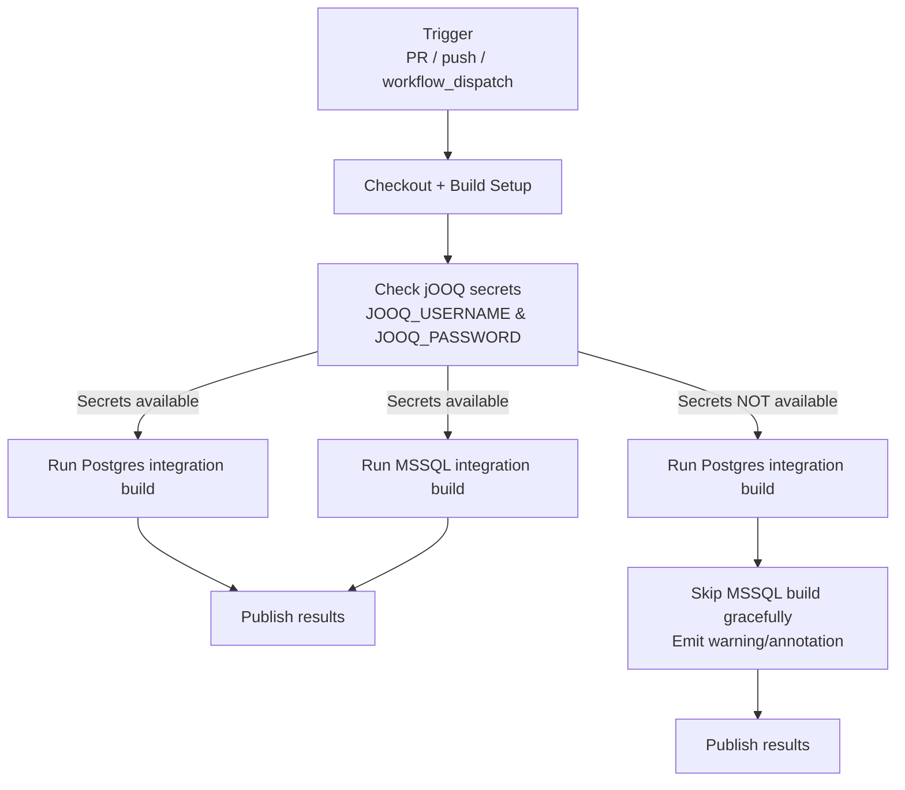

# Waltz Integration Builds (Postgres + MSSQL)


This repository supports running **dual database integration builds**:

- ✅ Postgres integration build
- ✅ MSSQL integration build (requires jOOQ licence secrets)

Due to GitHub security restrictions, secrets are **not available to pull requests raised from forks**.  
To accommodate this, the workflow includes a `workflow_dispatch` trigger to allow manual execution when needed.

---

## 🧱 Architecture Diagram

The diagram below shows how the GitHub Actions workflow gates the MSSQL integration build based on whether the
required jOOQ secrets are available.

> Tip: GitHub renders Mermaid diagrams automatically in Markdown.



### Key points

- **Postgres always runs** (fork PRs included).
- **MSSQL only runs when jOOQ secrets are available** (e.g., in the upstream repo, FINOS branches, or maintainer-triggered runs).
- When secrets are missing, the workflow **skips MSSQL cleanly** and still reports success for the overall pipeline.

---

## 🔐 GitHub Security Limitation

GitHub does **not expose repository secrets to PRs created from forks**.

Because the MSSQL build requires the following secrets:

- `JOOQ_USERNAME`
- `JOOQ_PASSWORD`

The MSSQL build cannot run automatically in fork-based PRs unless secrets are available in that repository.

---

## ⚙️ Workflow Behaviour

### When jOOQ Secrets Are NOT Available

- The Postgres build runs normally.
- The MSSQL build is **skipped gracefully**.
- The workflow completes successfully.
- A warning annotation explains why MSSQL was skipped.

This prevents unnecessary build failures while maintaining transparency.

---

### When jOOQ Secrets Are Available

- Both Postgres and MSSQL integration builds run.
- All artefacts are generated.
- Full database compatibility is validated.

---

# 🚀 Recommended Contribution Workflows

## ✅ Option 1 — Fork Maintains Its Own jOOQ Licence

Each fork maintains its **own jOOQ licence secrets**.

**Benefits:**
- MSSQL build runs automatically.
- Full dual-database testing in every PR.
- Faster feedback cycle.

Ideal for long-running or frequently updated forks.

---

## ✅ Option 2 — PR via FINOS Fork Branch

1. Raise a PR from your fork to a **temporary branch on the FINOS fork**.
2. Secrets are available in the FINOS fork.
3. Confirm both Postgres and MSSQL builds pass.
4. Raise a final PR from that branch to `master`.

This ensures full integration validation before merging.

---

## ✅ Option 3 — Maintainer-Triggered Full Build (Recommended for Open Contribution)

1. Contributor opens PR from fork.
   - Postgres build runs automatically.
   - MSSQL build is skipped (no secrets available).
2. Maintainer reviews the PR.
3. Maintainer manually triggers the full build using:
   - `workflow_dispatch`
   - or a re-run with secrets (if using protected environments).
4. Both Postgres and MSSQL builds run.
5. If green → merge directly.

**Benefits:**
- Secrets remain centralized and protected.
- No need for contributors to store licence keys.
- No intermediate PR branch required.
- Clean PR workflow.
- Maintainers retain control of licence usage.

Ideal for open-source governance models.

---

## 🛠 Manual Build Trigger

The workflow supports:

```
workflow_dispatch
```

This allows maintainers to run the full dual-database build on demand.

---

## 🧩 Graceful Failure Design

The workflow includes a `check-jooq-secrets` step which:

- Detects whether `JOOQ_USERNAME` and `JOOQ_PASSWORD` are configured.
- Conditionally enables the MSSQL build.
- Prevents hard failures when secrets are unavailable.
- Provides a clear annotation message in workflow logs.

---

## 📦 Build Matrix Overview

| Scenario | Postgres | MSSQL | Result |
|----------|----------|--------|--------|
| Fork PR (no secrets) | ✅ Runs | ⏭ Skipped | ✅ Success |
| Fork with secrets | ✅ Runs | ✅ Runs | ✅ Success |
| FINOS branch | ✅ Runs | ✅ Runs | ✅ Success |
| Maintainer-triggered build | ✅ Runs | ✅ Runs | ✅ Success |

---

## Summary

This setup provides:

- Secure handling of jOOQ licence secrets  
- Dual database validation  
- Clear contributor workflows  
- Graceful CI behaviour  
- Manual override capability  
